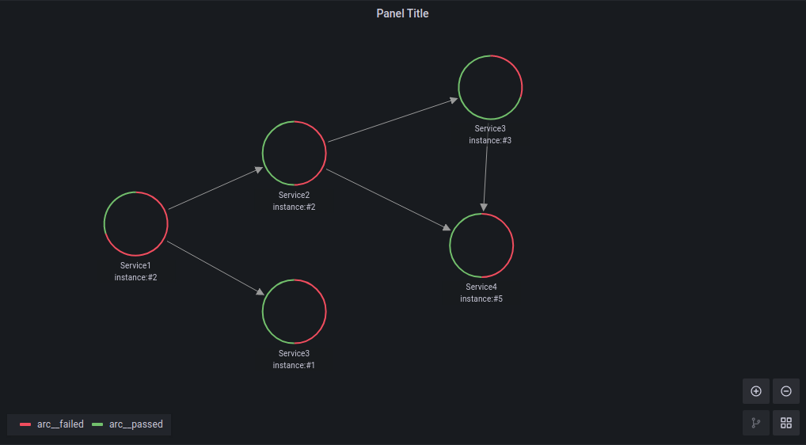
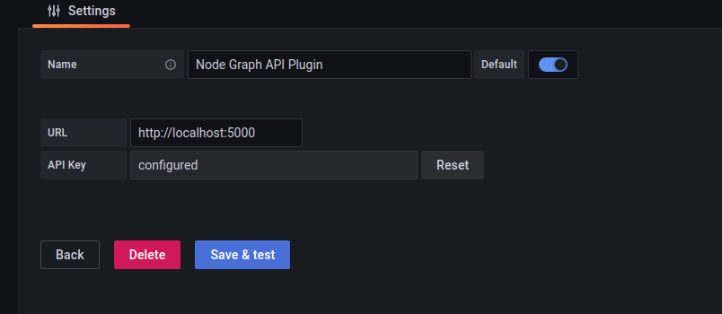
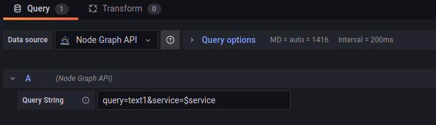

# Nodegraph API Plugin for Grafana

[](https://github.com/grafana/grafana-starter-datasource/actions?query=workflow%3A%22CI%22)

This plugin provides a data source to connect a REST API to [nodegraph](https://grafana.com/docs/grafana/latest/visualizations/node-graph/) panel of Grafana.



## Getting started

1. Use Grafana 7.4 or higher

- Download and place the data source in `grafana/plugins` directory.

This plugin is not signed yet; Grafana will not allow loading it by default. You have to enable it by adding:

for example, if you are using Grafana with containers, add:

```yaml
-e "GF_PLUGINS_ALLOW_LOADING_UNSIGNED_PLUGINS=hamedkarbasi93-nodegraphapi-datasource"
```

2. You can now add the data source. Just enter the URL of your API app and push "Save & Test." You will get an error in case of connection failure.

   > Note: The browser should have access to the application, not the Grafana server.



3. In the Grafana dashboard, pick the Nodegraph panel and visualize the graph.

## API Configuration

The REST API application should return data in the following format:

   > Note: Your API application should handle CORS policy. Otherwise, you will face a CORS-Policy error in Grafana.

### Fetch Graph Fields

This route returns the nodes and edges fields defined in the [parameter tables](https://grafana.com/docs/grafana/latest/visualizations/node-graph/#data-api).
It would help the plugin to create desired parameters for the graph.
For nodes, `id` and for edges, `id`, `source`, and `target` fields are required. Other fields are optional.

endpoint: `/api/graph/fields`

method: `GET`

content type: `application/json`

content format example:

```json
{
  "edges_fields": [
    {
      "field_name": "id",
      "type": "string"
    },
    {
      "field_name": "source",
      "type": "string"
    },
    {
      "field_name": "target",
      "type": "string"
    },
    {
      "field_name": "mainStat",
      "type": "number"
    }
  ],
  "nodes_fields": [
    {
      "field_name": "id",
      "type": "string"
    },
    {
      "field_name": "title",
      "type": "string"
    },
    {
      "field_name": "mainStat",
      "type": "string"
    },
    {
      "field_name": "secondaryStat",
      "type": "number"
    },
    {
      "color": "red",
      "field_name": "arc__failed",
      "type": "number"
    },
    {
      "color": "green",
      "field_name": "arc__passed",
      "type": "number"
    },
    {
      "displayName": "Role",
      "field_name": "detail__role",
      "type": "string"
    }
  ]
}
```

### Fetch Graph Data

This route returns the graph data, which is intended to visualize.

endpoint: `/api/graph/data`

method: `GET`

content type: `application/json`

Data Format example:

```json
{
    "edges": [
        {
            "id": "1",
            "mainStat": "53/s",
            "source": "1",
            "target": "2"
        }
    ],
    "nodes": [
        {
            "arc__failed": 0.7,
            "arc__passed": 0.3,
            "detail__zone": "load",
            "id": "1",
            "subTitle": "instance:#2",
            "title": "Service1"
        },
        {
            "arc__failed": 0.5,
            "arc__passed": 0.5,
            "detail__zone": "transform",
            "id": "2",
            "subTitle": "instance:#3",
            "title": "Service2"
        }
    ]
}
```

For more detail of the variables, please visit [here](https://grafana.com/docs/grafana/latest/visualizations/node-graph/#data-api).

### Health

This route is for testing the health of the API, which is used by the *Save & Test* action while adding the plugin.[(Part 2 of the Getting Started Section)](#getting-started).
Currently, it only needs to return the `200` status code in case of a successful connection.

endpoint: `/api/health`

method: `GET`

success status code: `200`

## API Example

In the `example` folder, you can find a simple API application in Python Flask.

### Requirements:

- flask
- flask-cors

### Run

```bash
python run.py
```
The application will be started on `http://localhost:5000`

## Query Configuration
You can pass a query string to apply for the data endpoint of the graph via *Query String*. Like any other query, you can utilize variables too:
 
 
 
 With variable `$service` defined as `processors`, above query will produce this endpoint:
 `/api/graph/data?query=text1&service=processors`
## Compiling the data source by yourself

1. Install dependencies

   ```bash
   yarn install
   ```

2. Build plugin in development mode or run in watch mode

   ```bash
   yarn dev
   ```

   or

   ```bash
   yarn watch
   ```

3. Build plugin in production mode

   ```bash
   yarn build
   ```

## Learn more

- [Build a data source plugin tutorial](https://grafana.com/tutorials/build-a-data-source-plugin)
- [Grafana documentation](https://grafana.com/docs/)
- [Grafana Tutorials](https://grafana.com/tutorials/) - Grafana Tutorials are step-by-step guides that help you make the most of Grafana
- [Grafana UI Library](https://developers.grafana.com/ui) - UI components to help you build interfaces using Grafana Design System

## Contributing

Thank you for considering contributing! If you find an issue or have a better way to do something, feel free to open an issue or a PR.

## License

This repository is open-sourced software licensed under the [Apache License 2.0](https://www.apache.org/licenses/LICENSE-2.0).
